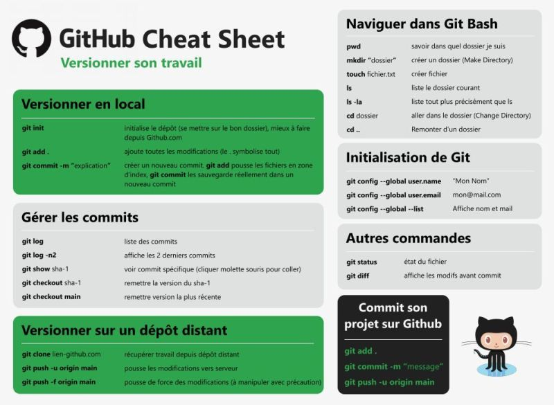

<pre># Titre principal</pre>
# Nom du projet
<pre>## Sous-titres (sections principales)</pre>
## Description 
Une courte description du projet.

## Fonctionnalités

- Fonction 1 
- Fonction 2
- Fonction en cours de développement

## Installation
Instructions pour installer le projet.

<pre>### Sous-Sections</pre>
### Prérequis

-  Java 21
- Docker

### Mise en forme

- **Le texte est en gras**
- **Attention** ** Le texte n'est pas en gras **
- *Le texte est en italique*
- ~~Le texte est barré~~

### Mettre du code

Sur une ligne:

Utiliser la commande `git init`

Sur plusieurs lignes:

```bash
git config user.name "Mon User Name"
git config user.email " Mon Email"

```
### Ajouter une image



### Ajouter un lien
[Nom du lien ici lien vers github](https://github.com/)

### Ajouter des checklists

- [x] Tâche 1 validée
- [ ] Tache 2 non validée

### Arborescence du projet

Pour générer automatiquement une arborescence avec la commande tree (sous Linux/macOS ou Windows avec Git Bash) :

`tree -L 2 > structure.txt`

Puis tu colles le contenu dans un bloc :
 <pre>
 ```bash 
 projets_git/
├── git_commande.jpg
├── Readme.md
└── structure.txt

1 directory, 3 files ``` 
</pre>

### Fin du Readme.md